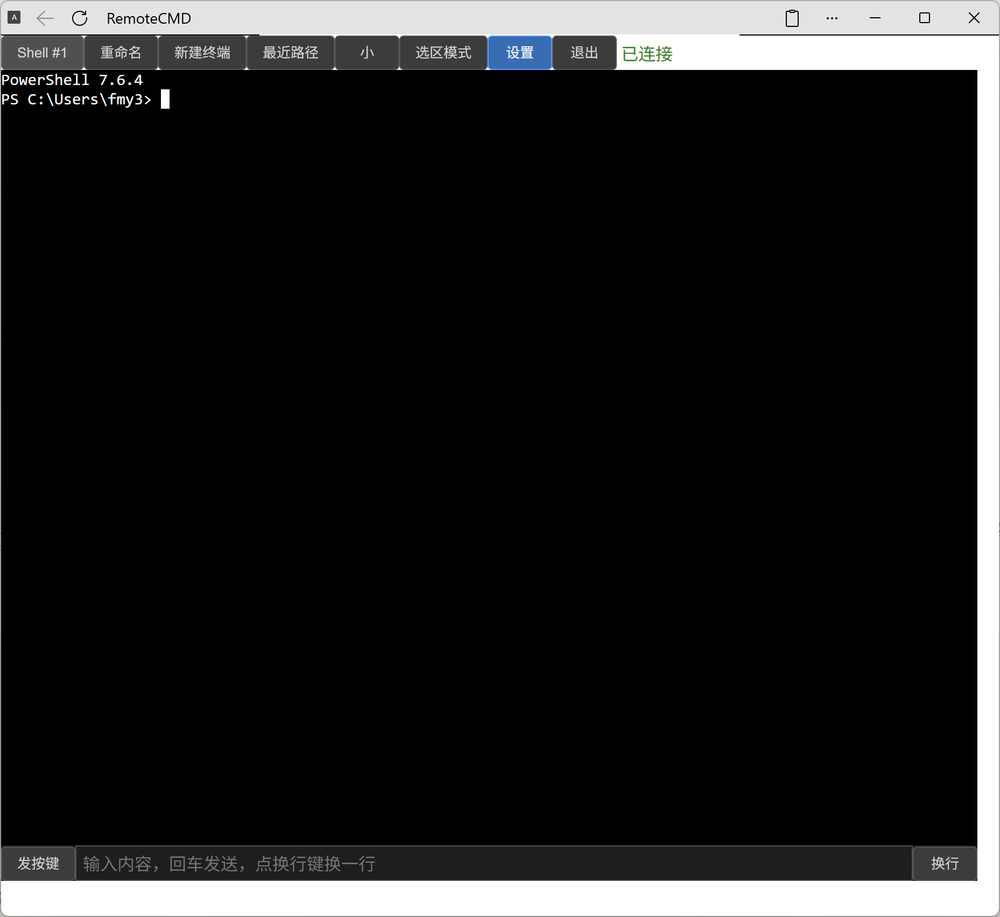

# RemoteCMD

[](LICENSE)
[](package.json)
[](https://xtermjs.org/)
[](#)

> 🌐 **用浏览器远程操控 Windows PowerShell 终端** —— 手机、平板、任意设备，
> 随时操作你的 agent CLI / TUI。

**RemoteCMD** 是一个基于 Web 的远程 PowerShell 终端。无需安装客户端、无需 SSH/VPN，
打开浏览器即可获得完整的 PowerShell 会话，并针对移动端做了深度优化。

---

## 📸 截图

<p align="center">
  
  
</p>

<p align="center">同一套界面，桌面与手机一致的远程终端体验。</p>

---

## 🎯 设计背后的故事

RemoteCMD 不是那种「把 SSH 套个 Web 壳」就完事的项目。这堆设计都是从真实使用里熬出来的。

### 为什么不走 SSH 网关

最常见做法是 `Web → SSH网关 → 目标机器`。RemoteCMD 没这么干——`node-pty` 直接在服务器上派生 PowerShell 进程，WebSocket 纯字节流双向透传。

核心理由就一条：**让终端变成一个纯粹的网页，在任何设备上无缝跑。**

网页不需要装客户端。不依赖 SSH。不依赖 VPN。手机、平板、Chromebook、公司电脑、别人的电脑——有浏览器就能用，打开同一个 URL 看到同一个终端。速度上也有好处：没有 SSH 握手开销，每条命令的响应时间就是你敲回车到看到输出的真实时间。

### 断线重连那段弯路

最早的重连方案是「客户端记尾字节偏移 + 服务端补差额」，类似 `tail -c+N`。听着合理对吧？实际一跑就炸——多终端写并发时，A 终端的输出和 B 终端的输出在字节流里是交错的，重连只看偏移量抓到的数据可能横跨两条终端，拼出来画面是花的。

最后被一个简单的办法解决：**在服务端跑一个无头 xterm**。headless xterm 一直在后台渲染所有输出，维护和客户端完全一致的画面。重连时直接把整屏序列化成 ANSI 转义序列，一次性推回来——`term.reset()` + `term.write(ansi)`，零数学计算，零拼图错误。

### 移动端的坑，一个一个摸过来的

好多 Web 终端在手机上"能用"但体验是「忍一下吧」。RemoteCMD 的移动端优化是踩坑踩出来的。

第一个坑：Android Chrome 接物理键盘时，`e.key` 返回 `Unidentified`。如果你用 `e.key === 'c'` 去匹配 Ctrl+C，绝对翻车。解决方案是改用 `e.code`，它不受键盘布局和输入法影响。

第二个坑：手机没有真正的键盘，打个 `Tab` 或 `↑` 要切到符号键盘，来回倒腾你想砸手机。所以在软键盘上方加了一排自定义快捷键按钮——Esc、Tab、方向键、Ctrl+C、刷新环境变量。直接点、直接发，不用再切键盘了。

第三个坑：输入条/弹窗不能被软键盘遮挡。根因（`svh`/`vh` 跟踪**布局视口**，软键盘只缩**视觉视口**）：纯 CSS 的 `50svh` 永远按全屏算、面板会伸入键盘下方，纯 CSS 无解。正确做法：**不**设 `interactive-widget: resizes-content`（设了反而引入布局视口 resize 时序坑，且荣耀真机验证输入条去掉它也没被遮挡——浏览器原生「聚焦时滚到键盘上方」已够）；弹窗限高由 JS 读 `visualViewport.height`（键盘上方真实高度）实时设置、键盘开/合时更新。

第四个坑：手机上没滚轮怎么回看终端输出？加了触摸滑动手势，两根手指上下划就能滚动。

### 为什么两套尺寸槽，不自动缩放

自动缩放听起来很美——换设备自动适配尺寸。但问题是 TUI 程序不懂什么叫响应式。你在 27 寸显示器上开 80×40 的终端，切到手机时它自动缩成 40×20，里面的表格、菜单全崩了。

解决方案朴素但管用：两套固定尺寸。一套「大」给桌面（充分利用宽屏），一套「小」给手机（适配窄屏）。一键切换，服务端实时调整 PTY 尺寸。不讲 VC 故事，管用就行。

### 登录：一枚 cookie，不存 session

没上 Redis，没搞 Session 表。登录态就一枚签名 cookie `rc_session = 时间戳.HMAC-SHA256(secret, 时间戳)`。无状态意味着无内存泄露、无过期竞态、可水平扩展——虽然单机部署也用不上水平扩展，但少维护一个 Session 存储总是好的。

密码文件直接复用 nginx 的 htpasswd，不搞第二套认证体系。`sessionSecret` 首次启动自动生成，不用操这个心。

### 快捷键的本质是发字符串

浏览器键盘事件跨平台差异太大，去适配每个浏览器的 key mapping 就是个无底洞。

所以 RemoteCMD 的快捷键不走键盘事件——你定义 "Tab" → `\t`、"Ctrl+C" → `\x03`、"↑" → `\x1b[A`，然后逐字符往 WebSocket 里塞。不依赖浏览器能正确识别哪个键被按了。手机端的快捷键栏按钮和桌面端实体键盘共享同一套映射，行为完全一致。

### 回车停顿是什么鬼

粘贴多行代码时，每行末尾带一个 `\r`。如果上百个 `\r` 同时砸向 PTY，子进程来不及消化就会丢输入。`enterDelayMs` 在每次发 `\r` 后停一小下（默认 300ms），让 PTY 缓口气。你可以从 50ms 调到 3000ms——越快越爽，越慢越稳。

### 最近路径

终端里最频繁的操作就是 `cd`。RemoteCMD 自动捕获 `cd` / `chdir`，把去过的地方记下来。路径太长时**右对齐截断**——保留尾巴上的区分段落，因为"项目名/分支名"在末尾，前面的盘符和用户目录反而不那么重要。

---

## 🚀 快速开始

```bash
# 1. 克隆仓库
git clone https://github.com/superafun/RemoteCMD.git
cd RemoteCMD

# 2. 安装依赖（node-pty 需要原生构建工具：Visual Studio Build Tools）
npm install

# 3. 生成配置文件
cp config.example.json config.json
#   编辑 config.json，至少设置 htpasswdPath 指向你的密码文件（见下方"配置"）

# 4. 安装并启动（PM2 守护，端口由 config.json 的 `port` 字段决定）
npm install -g pm2
npm start
```

浏览器打开 `http://localhost:<端口>`（端口见 config.json 的 `port` 字段），用 htpasswd 中的账号密码登录即可。

> 💡 没有 htpasswd 文件？用 nginx 自带工具生成：`htpasswd -c ./htpasswd 你的用户名`

---

## ⚙️ 配置（config.json）

复制 `config.example.json` 为 `config.json` 后按需修改。常用字段：

| 字段 | 类型 | 默认值 | 说明 |
|------|------|--------|------|
| `port` | number | 内置默认端口 | 监听端口（1–65535）；nginx 反代需与此一致 |
| `rows` / `cols` | number | 34 / 110 | 终端初始行列 |
| `hotkeys` | object | `{}` | 快捷键名 → 转义序列/命令 |
| `sizeSlots` | object | 见模板 | 大/小尺寸槽（rows/cols） |
| `currentSize` | string | `"small"` | 当前尺寸 `large` / `small` |
| `scrollIntervalTerminal` | number | 40 | 终端按住滚动间隔(ms) |
| `scrollIntervalPage` | number | 20 | 页面按住滚动间隔(ms) |
| `screenHistoryLines` | number | 500 | 重连滚屏历史行数 |
| `recentPathsLimit` | number | 10 | 最近路径保存条数(1–100) |
| `maxFrontendLogs` | number | 30 | 前端日志上限(条) |
| `sessionDurationHours` | number | 24 | 保持登录时长(小时) |
| `sessionSecret` | string | 服务端自动生成 | Cookie 签名密钥，**无需手动配置** |
| `htpasswdPath` | string | `./htpasswd` | 密码文件路径（nginx htpasswd 格式） |

> ⚠️ `config.json` 已在 `.gitignore` 中，**不会被提交**。请勿把含密码等敏感信息的 `config.json` 推送到公开仓库。

---

## 🖥️ 部署参考（nginx 反代 + TLS）

`server.js` 直接托管 `public/` 并监听 WebSocket（端口由 `config.json` 的 `port` 字段决定）。生产环境建议用 nginx 反代：

```nginx
server {
    listen 443 ssl;
    server_name your.domain;

    ssl_certificate     /path/to/fullchain.pem;
    ssl_certificate_key /path/to/privkey.pem;

    location /cmd/ {
        proxy_pass http://127.0.0.1:<端口>/;
        proxy_http_version 1.1;
        proxy_set_header Upgrade $http_upgrade;
        proxy_set_header Connection "upgrade";
        proxy_set_header Host $host;
        proxy_set_header X-Forwarded-Prefix /cmd/;
    }
}
```

- TLS 由 nginx 终结；RemoteCMD 自带登录页，nginx 块无需再加 `auth_basic`。
- 前端全用相对 URL，配合 `X-Forwarded-Prefix` 在子路径下正常工作。

---

## 🔒 安全说明

- `config.json`（本地运行配置）已被 `.gitignore` 排除，不会进入版本库。
- 登录 cookie 为 `HttpOnly` + `SameSite=Lax` + HTTPS 下自动 `Secure`。
- 密码复用 nginx htpasswd（`{SHA}` / `{PLAIN}` / 明文 / `$apr1$` 均支持）。
- 生产环境务必使用 HTTPS + 强密码。

---

## 📄 License

[MIT](LICENSE) © 2026 superafun

---

# English

## RemoteCMD

> 🌐 **Control a Windows PowerShell terminal from your browser** — phone, tablet,
> or any device, to operate your agent CLI / TUI anytime, anywhere.

RemoteCMD is a web-based remote PowerShell terminal. No client to install, no SSH/VPN —
just open a browser and get a full PowerShell session, with deep mobile optimizations.

### Design Philosophy

RemoteCMD isn't yet another "SSH in a web wrapper." The design came from real usage, not from a whiteboard.

**No SSH gateway** — deliberate. `node-pty` spawns real PowerShell processes on the server, WebSocket streams bytes to the browser. No SSH client needed on the client side. Why? Because **a browser runs on anything**: phone, tablet, Chromebook, whatever. Same URL, same terminal.

**Reconnect was a hard lesson.** First attempt: byte-offset diffing. Worked until two terminals interleaved their output — then reconnects produced garbage. The fix that stuck: a headless xterm on the server that renders everything in sync with the real display. Reconnect = freeze frame → serialize to ANSI → push whole frame. Zero math, zero mismatches.

**Mobile is full of traps.** Android Chrome returns `Unidentified` for `e.key` on physical keyboard shortcuts — `e.code` saves the day. No real keyboard on a phone? Put a shortcut bar (Esc, Tab, arrows, Ctrl+C, refresh Path) above the soft keyboard. Input bar sits above the soft keyboard via the browser's native "scroll focused input into view" — `interactive-widget: resizes-content` is deliberately NOT set (it would cause a layout-viewport resize timing glitch and, per on-device testing, isn't needed — the native scroll already keeps the input bar clear). The settings modal's height is set in JS from `visualViewport.height` (the real visible area above the keyboard), NOT `svh` — `svh`/`vh` track the layout viewport and never see the IME, so a pure-CSS `50svh` would overflow under the keyboard. Swipe to scroll because phones don't have wheels.

**Two size slots, not auto-resize.** TUI programs don't do responsive. A 27" monitor and a 6" phone want different terminal dimensions. Two presets, one tap, crisp at every size.

**Stateless auth = no session store.** One signed cookie (`rc_session = timestamp.HMAC-SHA256(secret, timestamp)`). No Redis, no memory table, no expiry races. Password file reuses nginx's htpasswd — one source of truth.

**Hotkeys are escape sequences, not key events.** Browser key handling is a mess. RemoteCMD maps named shortcuts to literal escape sequences (`Tab → \t`, `Ctrl+C → \x03`) and sends them char-by-char over WebSocket. Works identically on every browser. Works on mobile where there's no keyboard at all.

**Enter delay is a throttle.** Paste 100 lines and 100 `\r` chars hit the PTY in a burst. `enterDelayMs` (default 300ms) inserts a pause between lines — just enough to keep the terminal from choking.

**Recent paths track your breadcrumbs.** `cd` is the most typed command. RemoteCMD captures it automatically and right-aligns long paths — the project folder name at the end is what you actually care about.

### Quick Start
```bash
git clone https://github.com/superafun/RemoteCMD.git
cd RemoteCMD
npm install
cp config.example.json config.json   # edit htpasswdPath
npm install -g pm2 && npm start
```
Open `http://localhost:<PORT>` and log in with your htpasswd credentials (port = `config.json` `port`).

### License
[MIT](LICENSE) © 2026 superafun
