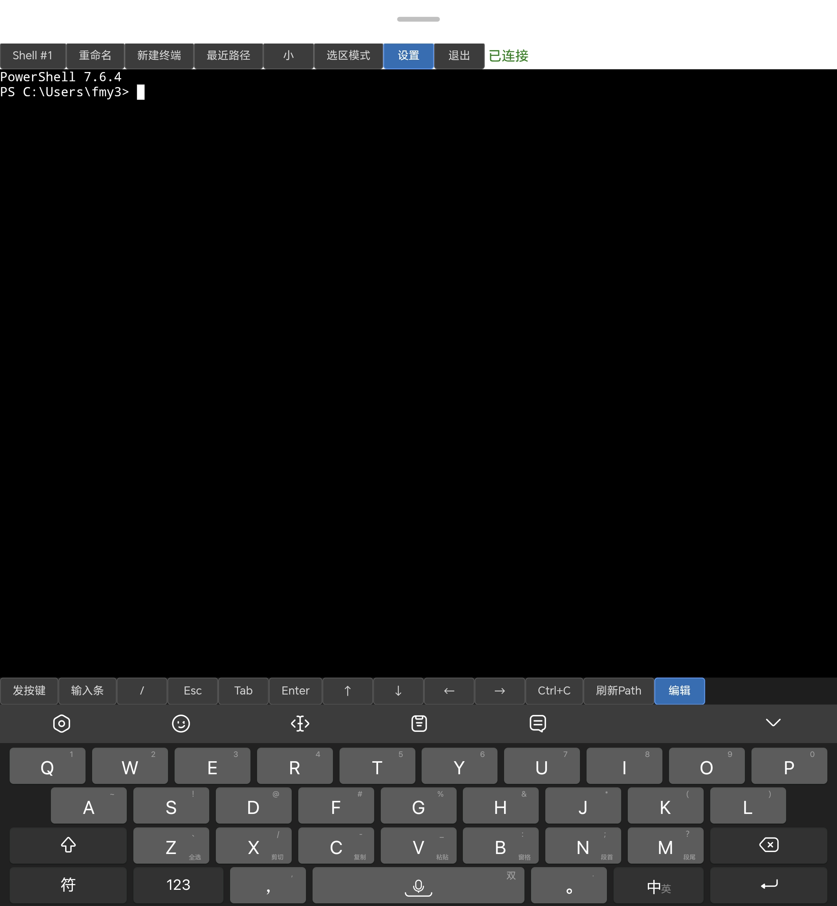

# RemoteCMD

[](LICENSE)
[](package.json)
[](https://xtermjs.org/)
[](#)

> 🌐 **用浏览器远程操控 Windows PowerShell 终端** —— 手机、平板、任意设备，
> 随时操作你的 agent CLI / TUI。

**RemoteCMD** 是一个基于 Web 的远程 PowerShell 终端。无需安装客户端、无需 SSH/VPN，
打开浏览器即可获得完整的 PowerShell 会话，并针对移动端做了深度优化。

---

## ✨ 功能亮点

| 🌐 零安装 | 📱 移动端优化 | 🔌 多会话 | ⌨️ 自定义快捷键 |
|----------|--------------|----------|----------------|
| 打开浏览器即用，无需客户端 | 软键盘快捷键栏 + e.code 匹配 + 底部固定 | 同时管理多个会话，一键切换 | 为常用命令绑定快捷键 |
| 🔄 断线重连 | 🔐 登录鉴权 | 📐 双尺寸槽 | 🛠️ 一键部署 |
| 整屏 ANSI 序列化同步 | 签名 cookie + htpasswd 验证 | 大/小尺寸快速切换 | PM2 守护 + nginx 反代 |

- **🌐 纯网页零安装**：任何支持浏览器的设备都能用，不依赖 SSH/VPN。
- **📱 移动端深度优化**：软键盘上方自定义快捷键栏（Esc / Tab / 方向键 / Ctrl+C / 刷新Path 等），
  通过 `e.code` 精确匹配按键，输入框底部固定，手机上也能流畅操作 agent CLI 与 TUI 程序
  （如 vim、htop、交互式安装器等）。
- **🔌 多会话切换**：同时维护多个 PowerShell 会话，工具栏一键切换，互不干扰。
- **⌨️ 自定义快捷键**：在设置中为常用命令或转义序列绑定名称，移动端一键发送。
- **🔄 断线自动重连**：重连时服务端以整屏 ANSI 序列化推回（含可见视口 + 有界滚动历史），
  不再有 tail 比对导致的画面缺失。
- **🔐 登录鉴权**：无状态签名 cookie（`rc_session`）+ 复用 nginx htpasswd 密码文件，
  可设"保持登录时长"，多端同步。
- **📐 大/小双尺寸槽**：预设两组终端尺寸，适配桌面大屏与手机窄屏，一键切换。
- **🛠️ PM2 守护 + nginx 部署**：`npm start` 即由 PM2 守护进程，`nginx` 反代并终结 TLS。

---

## 📸 截图

<p align="center">
  
  
</p>

<p align="center">同一套界面，桌面与手机一致的远程终端体验。</p>

---

## 🚀 快速开始

```bash
# 1. 克隆仓库
git clone https://github.com/superafun/RemoteCMD.git
cd RemoteCMD

# 2. 安装依赖（node-pty 需要原生构建工具：Visual Studio Build Tools）
npm install

# 3. 生成配置文件
cp config.example.json config.json
#   编辑 config.json，至少设置 htpasswdPath 指向你的密码文件（见下方"配置"）

# 4. 安装并启动（PM2 守护，默认 http://localhost:65433）
npm install -g pm2
npm start
```

浏览器打开 `http://localhost:65433`，用 htpasswd 中的账号密码登录即可。

> 💡 没有 htpasswd 文件？用 nginx 自带工具生成：`htpasswd -c ./htpasswd 你的用户名`

---

## ⚙️ 配置（config.json）

复制 `config.example.json` 为 `config.json` 后按需修改。常用字段：

| 字段 | 类型 | 默认值 | 说明 |
|------|------|--------|------|
| `rows` / `cols` | number | 34 / 110 | 终端初始行列 |
| `hotkeys` | object | `{}` | 快捷键名 → 转义序列/命令 |
| `sizeSlots` | object | 见模板 | 大/小尺寸槽（rows/cols） |
| `currentSize` | string | `"small"` | 当前尺寸 `large` / `small` |
| `scrollIntervalTerminal` | number | 40 | 终端按住滚动间隔(ms) |
| `scrollIntervalPage` | number | 20 | 页面按住滚动间隔(ms) |
| `screenHistoryLines` | number | 500 | 重连滚屏历史行数 |
| `recentPathsLimit` | number | 10 | 最近路径保存条数(1–100) |
| `maxFrontendLogs` | number | 30 | 前端日志上限(条) |
| `sessionDurationHours` | number | 24 | 保持登录时长(小时) |
| `sessionSecret` | string | 自动生成 | Cookie 签名密钥，**勿提交** |
| `htpasswdPath` | string | `./htpasswd` | 密码文件路径（nginx htpasswd 格式） |
| `feishuAppId` 等 | string | `""` | 飞书通知配置，留空则关闭 |

> ⚠️ `config.json` 已在 `.gitignore` 中，**不会被提交**。请勿把含 `sessionSecret` /
> 飞书凭证的真实 `config.json` 推送到公开仓库。

---

## 🖥️ 部署参考（nginx 反代 + TLS）

`server.js` 直接托管 `public/` 并监听 WebSocket（默认 `:65433`）。生产环境建议用 nginx 反代：

```nginx
server {
    listen 443 ssl;
    server_name your.domain;

    ssl_certificate     /path/to/fullchain.pem;
    ssl_certificate_key /path/to/privkey.pem;

    location /cmd/ {
        proxy_pass http://127.0.0.1:65433/;
        proxy_http_version 1.1;
        proxy_set_header Upgrade $http_upgrade;
        proxy_set_header Connection "upgrade";
        proxy_set_header Host $host;
        proxy_set_header X-Forwarded-Prefix /cmd/;
    }
}
```

- TLS 由 nginx 终结；RemoteCMD 自带登录页，nginx 块无需再加 `auth_basic`。
- 前端全用相对 URL，配合 `X-Forwarded-Prefix` 在子路径下正常工作。

---

## 🔒 安全说明

- `config.json`（含 `sessionSecret` 与飞书凭证）已被 `.gitignore` 排除，不会进入版本库。
- 登录 cookie 为 `HttpOnly` + `SameSite=Lax` + HTTPS 下自动 `Secure`。
- 密码复用 nginx htpasswd（`{SHA}` / `{PLAIN}` / 明文 / `$apr1$` 均支持）。
- 生产环境务必使用 HTTPS + 强密码。

---

## 📄 License

[MIT](LICENSE) © 2026 superafun

---

# English

## RemoteCMD

> 🌐 **Control a Windows PowerShell terminal from your browser** — phone, tablet,
> or any device, to operate your agent CLI / TUI anytime, anywhere.

RemoteCMD is a web-based remote PowerShell terminal. No client to install, no SSH/VPN —
just open a browser and get a full PowerShell session, with deep mobile optimizations.

### Features
- **🌐 Zero-install, web-only** — any browser-capable device works; no SSH/VPN.
- **📱 Mobile-optimized** — on-screen shortcut bar (Esc / Tab / arrows / Ctrl+C / refresh Path),
  `e.code`-based key matching, bottom-pinned input; smooth agent CLI & TUI on phones.
- **🔌 Multi-session** — manage several PowerShell sessions, switch with one tap.
- **⌨️ Custom hotkeys** — bind names to commands/escape sequences, send them in one tap.
- **🔄 Auto-reconnect** — full-screen ANSI serialization sync on reconnect (viewport + bounded scrollback).
- **🔐 Auth** — stateless signed cookie (`rc_session`) reusing your nginx htpasswd, with configurable session duration.
- **📐 Size slots** — preset large/small terminal sizes, one-click switch.
- **🛠️ Deploy** — `npm start` runs under PM2; nginx reverse-proxy + TLS reference included.

### Quick Start
```bash
git clone https://github.com/superafun/RemoteCMD.git
cd RemoteCMD
npm install
cp config.example.json config.json   # edit htpasswdPath
npm install -g pm2 && npm start
```
Open `http://localhost:65433` and log in with your htpasswd credentials.

### License
[MIT](LICENSE) © 2026 superafun
